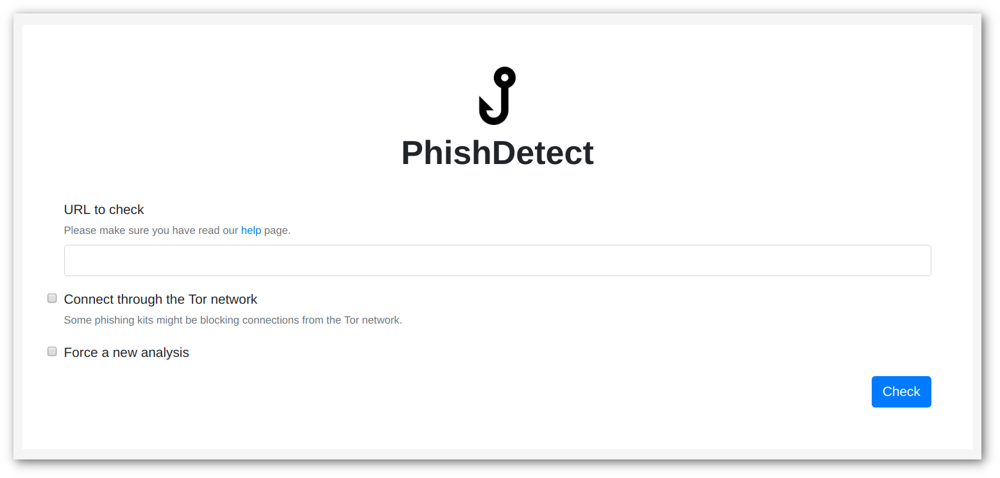
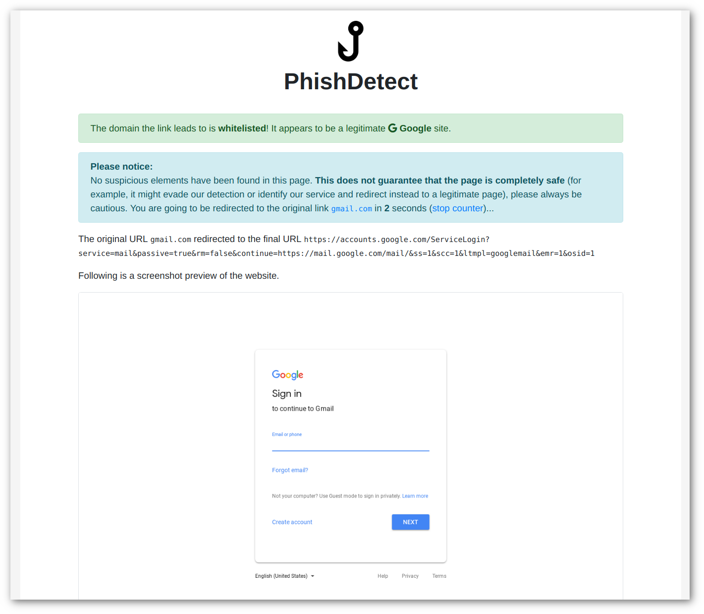
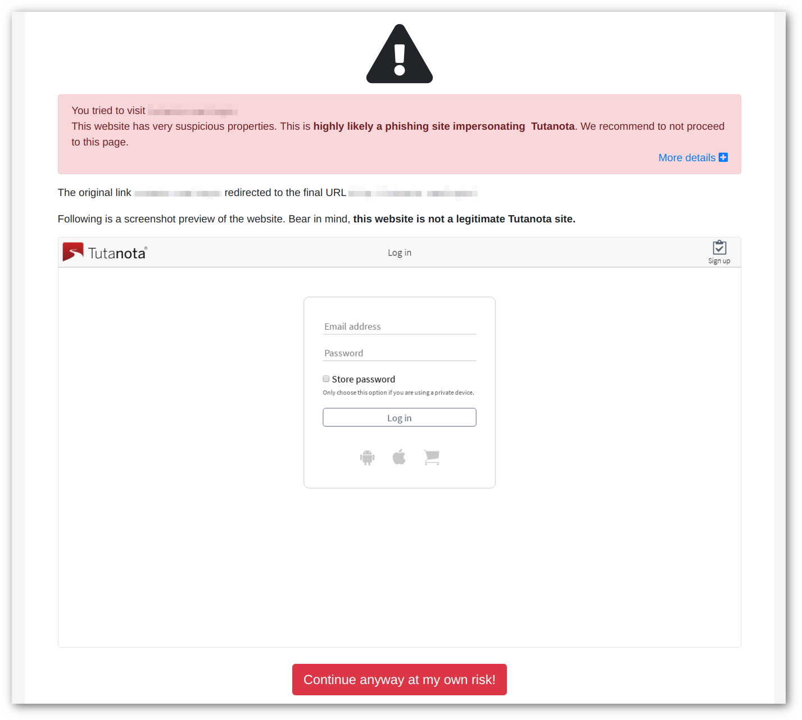

[](https://travis-ci.org/phishdetect/phishdetect)
[![Go Report Card][goreportcard-badge]][goreportcard]
[![GoDoc][godoc-badge]][godoc]

# PhishDetect

**NOTE: This project is experimental. It is not to be used yet, particularly with at-risk users.**

PhishDetect is a library and a platform to detect potential phishing pages.
It attempts doing so by identifying suspicious and malicious properties both in
the domain names and URL provided, as well as in the HTML content of the page
opened.

PhishDetect can take HTML strings as input, but it can also just be provided
with an URL which will then be opened through a dedicated Docker container which
automatically instruments a Google Chrome browser, whose behavior is monitored
while navigating to the suspicious link.

## Table of Contents

   * [PhishDetect](#phishdetect)
      * [Building](#building)
      * [Using PhishDetect CLI](#using-phishdetect-cli)
      * [Using PhishDetect Web Interface](#using-phishdetect-web-interface)
      * [Using PhishDetect as a library](#using-phishdetect-as-a-library)
         * [Analyzing a link statically](#analyzing-a-link-statically)
         * [Analyzing a link dynamically](#analyzing-a-link-dynamically)
      * [Known Issues](#known-issues)
      * [License](#license)

## Building

Install Docker Community Edition for [Windows](https://download.docker.com/win/stable/Docker%20for%20Windows%20Installer.exe), [Mac](https://download.docker.com/mac/stable/Docker.dmg) or [Linux](https://docs.docker.com/install/linux/docker-ce/ubuntu/).

Download the Docker image from Docker Hub using:

    $ docker pull phishdetect/phishdetect

Once the Docker image is created you can proceed building the binaries.
Proceed cloning the Git repository:

    $ git clone github.com/phishdetect/phishdetect.git

Move to directory you just cloned and proceed with downloading the depedencies:

    $ make deps

In order to build binaries for GNU/Linux:

    $ make linux

In order to build binaries for Mac:

    $ make darwin

In order to build binaries for Windows (this will require MingW to be installed):

    $ go get github.com/Microsoft/go-winio
    $ make windows

Once the compilation is completed, you will find two binaries in the `build/<linux/darwin/windows>/` folder. The first is a command-line interface, named `phishdetect-cli` and the second is the web interface, named `phishdetect-web`. Both are stand-alone binaries: they can be copied and run directly with no additional files required.

## Using PhishDetect CLI

Launch `phishdetect-cli -h` to view the help message:

    Usage of build/linux/phishdetect-cli:
      -api-version string
        	Specify which Docker API version to use (default: 1.37) (default "1.37")
      -debug
        	Enable debug logging
      -screen string
        	Specify the file path to store the screenshot
      -tor
        	Route connection through the Tor network
      -url-only
        	Only perform URL analysis

Specify a URL and the preferred options and wait for the results to appear:

    $ build/linux/phishdetect-cli -screen /tmp/screen.png -tor http://[REDACTED].com/Login
    INFO[0000] Analyzing URL http://[REDACTED].com/Login
    INFO[0000] Using User-Agent: Mozilla/5.0 (X11; Linux x86_64) AppleWebKit/537.36 (KHTML, like Gecko) Chrome/62.0.3202.89 Safar$
    INFO[0000] Using debug port: 9564
    INFO[0000] Enabled route through the Tor network
    INFO[0000] Started container with ID e43f6df4ab0fb8e29453df3ebaede0fe6a4bcbafa4fabaaa1da95573a28552ff
    INFO[0000] Attempting to connect to debug port...
    INFO[0001] Connection to debug port established!
    INFO[0013] Saved screenshot at /tmp/screen.png
    INFO[0013] Killed container with ID e43f6df4ab0fb8e29453df3ebaede0fe6a4bcbafa4fabaaa1da95573a28552ff
    INFO[0013] Starting to analyze HTML...
    INFO[0013] Matched password-input
    INFO[0013] Matched suspicious-title
    INFO[0014] Starting to analyze the URL...
    INFO[0014] Matched suspicious-hostname
    INFO[0014] Matched no-tls
    INFO[0014] Visits:
    INFO[0014]      - http://[REDACTED].com/Login
    INFO[0014]      - http://[REDACTED].com/Login/
    INFO[0014] Final URL: http://[REDACTED].com/Login/
    INFO[0014] Whitelisted: false
    INFO[0014] Final score: 90
    INFO[0014] Brand: tutanota
    INFO[0014] Warnings:
    INFO[0014]      - The page contains a password input         name=password-input score=10
    INFO[0014]      - The page has a suspicious title            name=suspicious-title score=30
    INFO[0014]      - The domain contains suspicious words       name=suspicious-hostname score=30
    INFO[0014]      - The website is not using a secure transport layer (HTTPS)  name=no-tls score=20

## Using PhishDetect Web Interface

The Web interface is primarily intended to be used in conjunction with the [Browser Extension](https://github.com/phishdetect/phishdetect-extension), but can also be used manually.

Launch with:

    $ build/linux/phishdetect-web

Once launched, it can be visited by opening the browser to `http://127.0.0.1:7856/check`.



After a few seconds, if the analyzed URL is not found to be suspicious, you are brought to a redirect page
that will show you a result similar to the following and after 30 seconds redirect you to the original URL.



In the case PhishDetect identifies suspicious elements in the analyzed page, it will show you a warning page
like the following and only allow you continue visiting the link after manual confirmation.



## Using PhishDetect as a library

First install the PhishDetect library dependency:

    $ go get -u -d github.com/phishdetect/phishdetect/lib/...

### Analyzing a link statically

You can then use it to analyze a URL or a domain like so:

```go
package main

import (
    "fmt"
    "github.com/phishdetect/phishdetect/lib"
)

func main() {
    // Instantiate an Analysis. The second argument is
    // an HTML string.
    a := phishdetect.NewAnalysis("example.com", "")
    // Perform the analysis of the URL/domain.
    a.AnalyzeURL()
    // Retrieve the name of the the impersonated brand.
    brand := a.Brands.GetBrand()

    // If the domain is recognized as whitelisted, this
    // will show as true, otherwise as false.
    fmt.Println(a.Whitelisted)
    // This is a total numeric value that is the sum of
    // all the score values of the warnings that were
    // matched during the analysis.
    fmt.Println(a.Score)
    // Print the brand. It will be an empty string if
    // no brand was identified.
    fmt.Println(brand)

    // Print all the matched warnings from the analysis.
    for _, warning := range a.Warnings {
        fmt.Println(warning.Description)
    }
}
```

### Analyzing a link dynamically

If you want to analyze a URL by launching the dockerized Google Chrome:

```go
package main

import (
    "fmt"
    "github.com/phishdetect/phishdetect/lib"
)

func main() {
    url := "example.com"
    // Instantiate a new Browser.
    // The first argument is the URL to analyze.
    // The second argument is the path to the file where to save the screenshot.
    // The third argument is a boolean value to enable or disable routing through Tor.
    b := phishdetect.NewBrowser(url, "/path/to/screen.png", false)
    // Run the browser.
    b.Run()

    // Now we analyze the results.
    a := phishdetect.NewAnalysis(url, b.HTML)
    a.AnalyzeURL()
    // Analyze the HTML string.
    a.AnalyzeHTML()
    brand := a.Brands.GetBrand()

    // In addition to the results explained in the previous example, we have
    // soma additional information provided by the browser execution.
    // FinalURL will show the last visited URL by the browser. This might differ
    // from the original URL if the browser was redirected.
    fmt.Println(b.FinalURL)

    // Visits contains a list of all the URLs visited by the browser.
    // Normally 302 redirects or JavaScript redirects should appear (although in
    // the latter case, some might not appear if it took to long to load.)
    for _, visit := range b.Visits {
        fmt.Println(visit)
    }

    // In addition to the URL analysis warnings, we should also have any matched
    // HTML analysis warnings.
}
```

For more information, please refer to the [Godoc][godoc].

## Known Issues

- Using the service in localhost through the Mozilla Firefox browser on Linux has issues and it will likely not work. Other browsers seem to work fine.

## License

PhishDetect is released under GNU Affero General Public License 3.0 and is copyrighted to Claudio Guarnieri.

[goreportcard]: https://goreportcard.com/report/github.com/phishdetect/phishdetect/lib
[goreportcard-badge]: https://goreportcard.com/badge/github.com/phishdetect/phishdetect/lib
[godoc]: https://godoc.org/github.com/phishdetect/phishdetect/lib
[godoc-badge]: https://godoc.org/phishdetect/phishdetect/lib?status.svg

